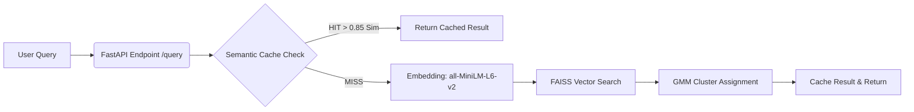

# 🔍 Semantic Search & Fuzzy Clustering API


A full-stack NLP pipeline that performs **semantic search** over the 20 Newsgroups dataset (~20K documents). It leverages **fuzzy clustering**, a **custom semantic cache**, and a high-performance **FastAPI** web service to deliver exact vector search in under 10ms.

---

<details>
<summary><b>📑 Table of Contents</b></summary>

- [Architecture](#-architecture)
- [Key Design Decisions](#-key-design-decisions)
- [Project Structure](#-project-structure)
- [Quick Start](#-quick-start)
- [API Reference](#-api-reference)
- [Docker Deployment](#-docker-deployment)
- [Testing](#-testing)

</details>

---

## 🏗️ Architecture



---

## 🧠 Key Design Decisions

<details>
<summary><b>1. Embedding Model: <code>all-MiniLM-L6-v2</code></b></summary>
<b>Why:</b> Produces 384-dimensional vectors and is trained on 1B+ sentence pairs for semantic similarity. It's extremely lightweight (22M parameters, ~80MB) yet ranks highly on MTEB benchmarks. Perfect for CPU-based deployments.
<br><b>Why not larger models:</b> Models like <code>all-mpnet-base-v2</code> (768-dim) offer only marginal quality gains while requiring 2x the storage and delivering slower search times.
</details>

<details>
<summary><b>2. Vector Database: FAISS (<code>IndexFlatIP</code>)</b></summary>
<b>Why:</b> An in-process C++ library meaning no external server overhead. Provides native disk persistence (~28MB for 19K docs). 
<br><b>Why <code>IndexFlatIP</code>:</b> With ~19K documents, exact search is incredibly fast (<10ms). Approximate indexes (like IVF) introduce accuracy trade-offs that only become necessary at the 100K+ document scale.
</details>

<details>
<summary><b>3. Fuzzy Clustering: Gaussian Mixture Model (GMM)</b></summary>
<b>Why GMM over K-Means/FCM:</b> Delivers probabilistic output (probability distribution per document), allows for flexible elliptical cluster shapes, and provides built-in BIC/AIC for optimal cluster count selection.
<br><b>Why Fuzzy:</b> Hard clustering is strictly forbidden in this pipeline because documents organically belong to multiple topics.
</details>

<details>
<summary><b>4. Custom Semantic Cache (No Redis/Memcached)</b></summary>
<b>Mechanism:</b> Computes cosine similarity between incoming query embeddings and cached queries. If <code>similarity > 0.85</code>, it results in a cache hit.
<br><b>Cluster-Aware Routing:</b> Cache entries are grouped by cluster ID, optimizing the search time complexity from O(n) to O(n/k).
</details>

<details>
<summary><b>5. NLP Data Cleaning Strategy</b></summary>
<b>What we strip:</b> Email headers, quoted replies, signatures, HTML, URLs, email addresses, and duplicates.
<br><b>What we keep:</b> Natural sentence structure, punctuation, grammar, and stopwords.
<br><b>Why:</b> Transformer models rely heavily on syntactic structure to generate accurate dense embeddings. Aggressive stopword removal (which works well for TF-IDF) degrades deep learning embedding quality.
</details>

---

## 📁 Project Structure

```text
semantic-search-pipeline/
├── app/
│   ├── api/                 # FastAPI routes and Pydantic schemas
│   ├── core/                # Core configurations
│   └── services/            # Business logic (Embeddings, FAISS, Clustering, Cache)
├── scripts/                 # CLI tools for data fetching, cleaning, and model building
├── data/
│   ├── raw/                 # Original 20 Newsgroups dataset
│   └── processed/           # Cleaned corpus ready for embedding
├── models/                  # Saved embeddings, FAISS indices, and GMM models
├── tests/                   # Pytest suite
├── docs/                    # Additional documentation (EDA findings)
├── main.py                  # API Entry point
└── docker-compose.yml       # Container orchestration
```

---

## 🚀 Quick Start

### 1. Local Setup

Clone the project and set up a virtual environment:

```bash
python -m venv venv
source venv/bin/activate   # Windows: .\venv\Scripts\Activate.ps1
pip install -r requirements.txt
```

### 2. Build the Pipeline

Run the data engineering and model training scripts (only needed once):

```bash
python scripts/data_pipeline.py       # Fetch + load + save corpus
python scripts/clean_data.py          # Clean corpus
python scripts/build_vector_db.py     # Generate embeddings + FAISS index
python scripts/build_clusters.py      # Train fuzzy clustering
```

### 3. Start the API Server

```bash
uvicorn main:app --host 0.0.0.0 --port 8000 --reload
```
> **Tip:** Visit `http://localhost:8000/docs` to interact directly with the Swagger UI!

---

## 🔌 API Reference

### `POST /query`
Execute a semantic search against the corpus.

<details>
<summary><b>View Request / Response Details</b></summary>

**Request:**
```json
{ 
  "query": "What is the best graphics card?" 
}
```

**Response:**
```json
{
  "query": "What is the best graphics card?",
  "cache_hit": false,
  "matched_query": null,
  "similarity_score": null,
  "result": [
    { "category": "comp.graphics", "score": 0.82, "text": "..." }
  ],
  "dominant_cluster": 3
}
```
</details>

### `GET /cache/stats`
Retrieve real-time metrics on cache performance.

```json
{ 
  "total_entries": 42, 
  "hit_count": 15, 
  "miss_count": 27, 
  "hit_rate": 0.3571 
}
```

### `DELETE /cache`
Flush the semantic cache.

```json
{ 
  "message": "Cache flushed successfully.", 
  "status": "ok" 
}
```

---

## 🐳 Docker Deployment

To spin up the entire API in an isolated container environment:

```bash
docker-compose up --build
```
*The API will be instantly available at `http://localhost:8000`.*

---

## 🧪 Testing

Execute the test suite using `pytest`:

```bash
pytest tests/ -v
```

---
*Built for scale. Optimized for exact match search.*
